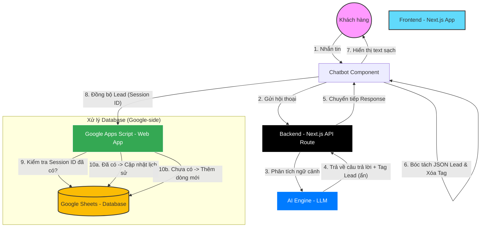

# Sơ đồ Kiến trúc & Luồng dữ liệu (Project Architecture)

Tài liệu này mô tả cách hệ thống Chatbot AI của bạn hoạt động, từ lúc khách hàng nhắn tin cho đến khi dữ liệu được lưu trữ tự động vào Google Sheets.

---

## 1. Sơ đồ luồng (Data Flow Diagram)

---

## 2. Vai trò của từng thành phần

### 🛡️ Frontend (Giao diện người dùng)
*   **Thành phần:** Next.js (Chatbot Component).
*   **Trách nhiệm:** 
    *   Quản lý trạng thái hội thoại.
    *   "Lọc" (Filter) các thông tin nhạy cảm/kỹ thuật trước khi hiển thị cho khách.
    *   Thực hiện gửi dữ liệu `Lead` ngầm tới Google Apps Script mà không làm giắc đoạn việc chat.

### ⚙️ Backend (Bộ não xử lý)
*   **Thành phần:** Next.js API Routes (`/api/chat`).
*   **Trách nhiệm:**
    *   Bảo mật API Key của AI (không để lộ phía client).
    *   Kết nối với Knowledge Base (Dữ liệu doanh nghiệp).
    *   Ra lệnh cho AI phải lấy thông tin khách thông qua `System Prompt`.

### 🧠 AI Engine
*   **Trách nhiệm:** 
    *   Tư vấn giải pháp cho khách.
    *   Tự động nhận diện Tên, SĐT trong câu chat và đóng gói vào thẻ `||LEAD_DATA:...||`.

### 📊 Database (Lưu trữ - Google Sheets)
*   **Thành phần:** Google Sheets + Apps Script.
*   **Trách nhiệm:**
    *   **Apps Script:** Đóng vai trò là một "Controller" (Bộ điều hướng). Nó kiểm tra xem khách này đã chat trước đó chưa (dựa trên `Session ID`).
    *   **Google Sheets:** Đóng vai trò là "Database". Lưu trữ thông tin khách để anh có thể mở điện thoại ra xem bất cứ lúc nào và gọi điện tư vấn ngay.

---

## 3. Tại sao kiến trúc này lại tối ưu?

1.  **Tốc độ:** Khách hàng thấy AI trả lời ngay lập tức. Việc lưu vào bảng tính diễn ra "ngầm" ở nền (background).
2.  **Bảo mật:** Toàn bộ lịch sử chat và thông tin cá nhân khách được đẩy trực tiếp từ trình duyệt khách lên Cloud của Google, không qua server trung gian nào khác.
3.  **Chi phí $0:** Toàn bộ hệ thống (Next.js, Vercel, Google Sheets) anh đều có thể chạy trên gói miễn phí nhưng vẫn đáp ứng được hàng ngàn khách/tháng.
4.  **Dễ quản lý:** Anh không cần code SQL hay quản trị server phức tạp. Cứ mở file Excel ra là có khách!
